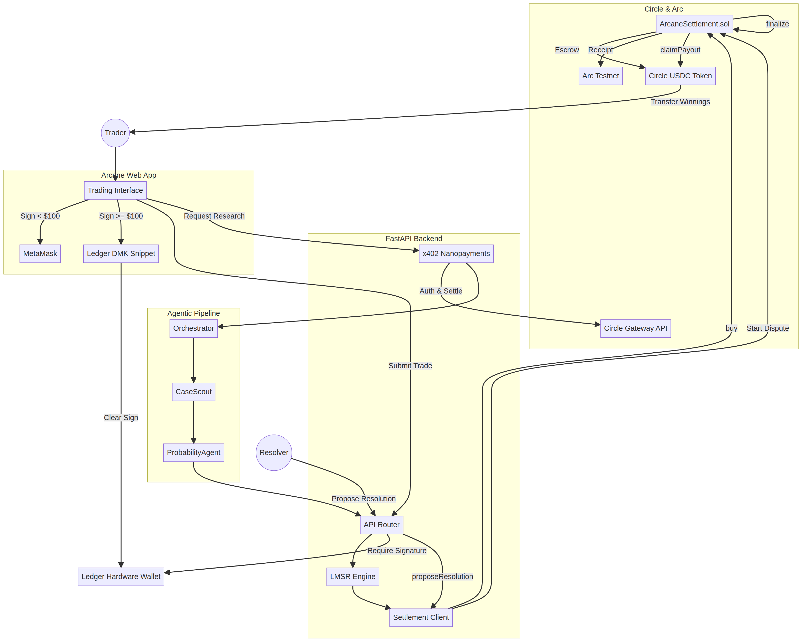

# Arcane · Agentic Legal Prediction Markets

**Arcane** is an autonomous, agent-driven prediction market platform for legal and regulatory risk. It uses an ensemble of 9 specialized AI agents to analyze live court dockets and SEC filings, pricing the outcomes of high-stakes litigation via an LMSR AMM engine. 

This repository represents our submission for the **ETH Global NYC** hackathon, specifically targeting the **Circle**, **Arc**, and **Ledger** bounties. We have integrated programmable USDC settlement, x402 agent-to-agent nanopayments, and hardware-enforced trading policies directly into the market lifecycle.



---

## 🏆 Bounty Alignment

Arcane was built from the ground up to showcase the power of the Circle/Arc/Ledger stack.

| Bounty Track | How Arcane Qualifies |
| :--- | :--- |
| **Best Agentic Economy with Circle Agent Stack** | **Full integration.** Arcane features 9 distinct AI agents (CaseScout, Docket, Precedent, Probability, etc.) that compensate each other for research using **Circle Gateway x402 nanopayments**. When a user requests research, the frontend pays the Orchestrator agent in USDC via EIP-3009, which then batch-settles micro-fees to sub-agents for parsing PDFs and running probability models. |
| **Best Prediction Markets Built on Arc** | **Full integration.** We wrote and deployed `ArcaneSettlement.sol` to Arc Testnet. Every market is created on-chain. Trades are executed via an LMSR AMM and settled deterministically on Arc, emitting `TradeExecuted` receipts visible on ArcScan. Resolutions trigger a 24-hour on-chain dispute window before users can claim their USDC payouts. |
| **Ledger: Best integration of Clear Signing** | **Full integration.** We implemented a dynamic risk policy engine. Trades under $100 use standard MetaMask EIP-712 signatures. Trades over $100, and **all market resolutions**, strictly require **Ledger hardware device approval**. We integrated the Ledger DMK to generate clear-signing artifacts so users see exact market details (Market, Side, Amount, Max Price) on their Ledger screens before signing. |

---

## ⚙️ Technical Architecture

### 1. Smart Contract (`ArcaneSettlement.sol`)
Deployed on **Arc Testnet**, the contract manages the full 7-state market lifecycle:
`Open` → `Closed` → `ResolutionProposed` → `Disputed` → `Finalized` → `Voided`

- **USDC Escrow**: Uses Circle's Testnet USDC contract to escrow funds.
- **Relayer Model**: The Python backend acts as a relayer, submitting user-signed EIP-712 intents to the contract to abstract gas fees while maintaining non-custodial settlement.
- **Dispute Window**: Proposing a resolution locks the market for 24 hours. If uncontested, it can be finalized and payouts claimed.

### 2. FastAPI Backend
- **LMSR AMM**: Calculates logarithmic market scoring rule prices and price impact.
- **x402 Middleware**: Intercepts requests to `/api/markets/{id}/research`, checks EIP-3009 authorization headers, verifies Circle wallet balances, and logs nanopayments.
- **Ledger Policy Engine**: Generates EIP-712 typed data payloads dynamically based on trade size, returning the DMK JavaScript snippet to the frontend.

### 3. Agentic Pipeline
A multi-agent LLM pipeline that ingests real-time data from the CourtListener API.
- **CaseScout**: Monitors dockets for new filings.
- **PrecedentAgent**: Analyzes historical case law.
- **ProbabilityAgent**: Synthesizes agent outputs into a quantitative P(YES) forecast.

---

## 🚀 Live Demo

A live instance of Arcane is currently running on the Arc Testnet. 

**Public URL:** [Arcane Live MVP](https://8000-iwt1ip4bihv7j9swzkvnu-ed39edef.us2.manus.computer/)

### How to test the integration:
1. **Connect Wallet**: Click "Connect Wallet" in the top right. You can use the built-in Demo Wallet (pre-funded with simulated USDC) to test the UI immediately.
2. **Execute a Trade**: Select "YES" or "NO" on any market. Enter an amount (e.g., $50). Click "Execute Trade".
3. **Verify on ArcScan**: In the "Settlement Contract" tab on the right, you will see the live ArcScan link for your `buy()` transaction.
4. **Trigger Agent Research**: Click the "Run Agent Analysis" button. You will see the x402 nanopayment log update as agents pay each other USDC for API calls.
5. **Ledger Policy**: Try to trade $150 USDC. The UI will block the standard signature and prompt for a Ledger hardware device connection.

---

## 💻 Local Setup & Deployment

### Prerequisites
- Python 3.11+
- Foundry (forge, cast, anvil)
- Node.js (for frontend dependencies if modifying UI)

### 1. Install Dependencies
```bash
git clone https://github.com/yourusername/arcane.git
cd arcane
pip install -r requirements.txt
```

### 2. Environment Configuration
Copy `.env.example` to `.env` and fill in your keys:
```env
# Required for live agent models
OPENAI_API_KEY=sk-...

# Required for live CourtListener data
COURTLISTENER_TOKEN=...

# Required for real Arc Testnet settlement
ARC_OPERATOR_PRIVATE_KEY=0x...
PAYMENTS_LIVE=true
```

### 3. Deploy Contract to Arc Testnet
```bash
cd contracts
forge build
forge create src/ArcaneSettlement.sol:ArcaneSettlement \
  --rpc-url https://rpc.testnet.arc.network \
  --private-key $ARC_OPERATOR_PRIVATE_KEY \
  --constructor-args $ARC_OPERATOR_ADDRESS $ARC_OPERATOR_ADDRESS 0x1c7D4B196Cb0C7B01d743Fbc6116a902379C7238
```
*Update `SETTLEMENT_CONTRACT_ADDRESS` in your `.env` with the deployed address.*

### 4. Run the Server
```bash
python3 run.py
```
The application will be available at `http://localhost:8000`.

---

## 📜 License
MIT License. See `LICENSE` for details.
